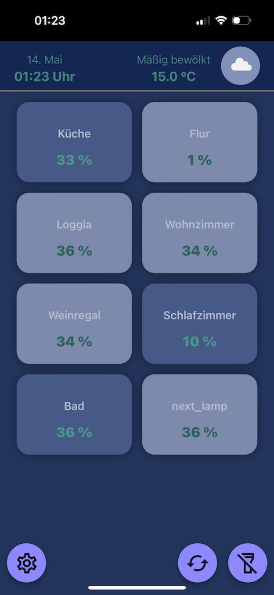
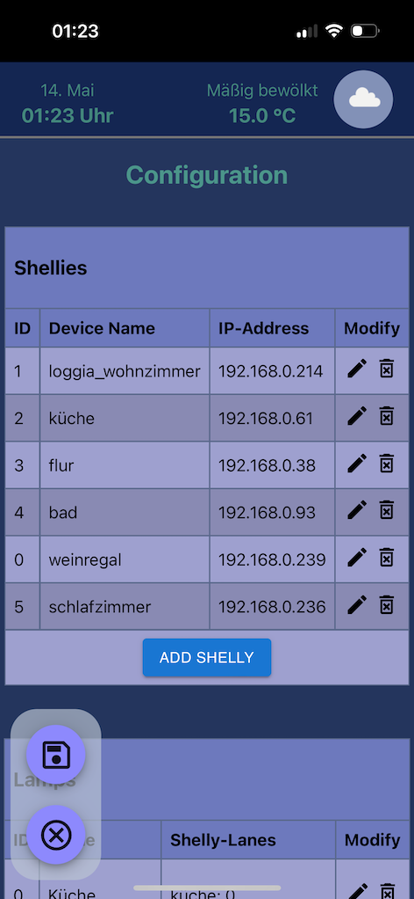

# ShellyControl
ShellyControl is a small hub to control your Shelly LEDs via a webinterface. It consists of 
- a rust backend
- a react frontend
served in your local network via Docker containers (leveraging Treafik as a fine proxy).

## What it looks like





## Steps to run the ShellyControl via Docker
### install docker
take a look at the docker.io website for installation guides [[https://docs.docker.com/get-docker/]]

### configure docker to restart containers after reboot (linux):
```
sudo systemctl enable docker
```

### use docker.io images or build everything from scratch
i already built the images for the rust-backend and the react-frontend for raspberry pi and uploaded them to docker.io.
nevertheless you can of course build them and compile them yourself. but on a raspberry pi compiling the rust backend might exceed the 
capabilities of these relatively weak devices...

depending on your choice you can clone the whole repository or just get the `compose.yaml`, the `configuration.env.example` and the 
`my_shellies_and_lamps.yaml.example` files and copy them to a folder on your device.
Make sure to rename the `.example` files by removing the `.example`.

## Get an openweather api key here
https://openweathermap.org/price  --> free plan!
https://home.openweathermap.org/users/sign_up

OR disable the retrievement in the `configuration.env`

### adjust compose.yaml to your needs
You may want to adjust the port, the react frontend is exposed to your local network. Default is `80`.


### run docker compose
```
# using the prebuilt images from docker.io (linux/amd64 or linux/arm/v7 (raspberry pi))
docker compose up -d 

# OR building the images locally (can take quite a while)
docker compose -f compose_local_build.yaml up -d --build 
```

### visit website
open "http://your-host" 
(maybe adjust the port to what you have specified in the traefik service)

add your shellies and configure your lamps in the settings section (the gear symbol down left)